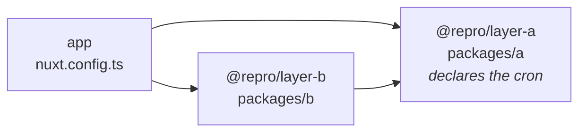

# Repro: a layer reached twice by package name duplicates its Cloudflare cron

One cron, authored once, in one layer. The layer is reached by two paths in the `extends` graph.
`.output/server/wrangler.json` comes out with the schedule in it twice, and `wrangler deploy` is
rejected by the Cloudflare API:

```
✘ [ERROR] Trigger configuration for "<worker>" was only partially updated:
    Cron schedules:
      - A request to the Cloudflare API (/accounts/<id>/workers/scripts/<worker>/schedules) failed.
        - duplicate cron found: 0 0 * * * [code: 10100]
```

The same graph spelled with **relative paths instead of package names** produces the correct
single-entry array. That contrast is the whole finding: Nuxt already dedupes a layer reached twice,
but only when the `extends` entry is a path it can `existsSync`.

| | |
| --- | --- |
| `nuxt` | 4.5.2 |
| `nitropack` | 2.13.4 (the current `latest`) |
| `c12` | 3.3.4 |
| `defu` | 6.1.7 |
| `node` | v24.20.0 |

Those are resolved versions, printed by the run rather than copied from `package.json`. They are at
the top of the result block in [`repro.log`](./repro.log).

## Run it

```bash
npm install
npm run repro
```

[`repro.mjs`](./repro.mjs) builds twice, once each way, and prints what nitro generated. No
Cloudflare account and no deploy: this is entirely a build-time bug. It exits non-zero if the
expected outcome is not observed, so it doubles as a regression check.

## The graph



[`packages/a/nuxt.config.ts`](./packages/a/nuxt.config.ts) is the tip of the diamond and the only
file in the repo that names a cron:

```ts
nitro: {
  experimental: { tasks: true },
  scheduledTasks: { '0 0 * * *': ['someTask'] },
  cloudflare: { wrangler: { triggers: { crons: ['0 0 * * *'] } } },
}
```

[`packages/b/nuxt.config.ts`](./packages/b/nuxt.config.ts) only re-exports the graph edge; it
contributes no config of its own. The root [`nuxt.config.ts`](./nuxt.config.ts) extends both.

`REPRO_EXTENDS=path` swaps every `extends` entry from the package name to the equivalent relative
directory, in both places. Nothing else changes — same two layers, same diamond, same nitro.

## Result

Real output from `npm run repro`. Full log in [`repro.log`](./repro.log).

```
=============== RESULT ===============
node       : v24.20.0
nuxt       : 4.5.2
nitropack  : 2.13.4
c12        : 3.3.4
defu       : 6.1.7
--------------------------------------
authored once, in packages/a/nuxt.config.ts:
  nitro.cloudflare.wrangler.triggers.crons = ["0 0 * * *"]
  nitro.scheduledTasks                     = {"0 0 * * *":["someTask"]}
--------------------------------------
extends: ['@repro/layer-a', '@repro/layer-b']     <- package names
  .output/server/wrangler.json  "triggers" : {"crons":["0 0 * * *","0 0 * * *"]}
  .output/server/.../nitro.mjs             : cron:"0 0 * * *",tasks:["someTask","someTask"]

extends: ['./packages/a', './packages/b']         <- same graph, relative paths
  .output/server/wrangler.json  "triggers" : {"crons":["0 0 * * *"]}
  .output/server/.../nitro.mjs             : cron:"0 0 * * *",tasks:["someTask"]
--------------------------------------
package-name extends duplicates the cron (expected true) : true
relative-path extends does not              (expected true) : true
BUG REPRODUCED                                              : true
======================================
```

**Two symptoms, one cause.** The wrangler `crons` array is the one that fails the deploy loudly. The
task list beside it fails quietly: `tasks: ["someTask", "someTask"]` means the task body runs twice
on every fire, on any preset, with no error anywhere.

## Where it happens

Not in nitro. Nitro's code is byte-identical across the two runs above; only the config handed to it
differs. `nitro.options.cloudflare.wrangler.triggers.crons` already holds two entries by the time
`writeWranglerConfig` in `node_modules/nitropack/dist/presets/cloudflare/utils.mjs` reads it.

The merge happens in Nuxt's layer loader. c12 walks `extends` recursively and pushes every resolved
layer onto `_layers` with no identity check (`extendConfig` in `unjs/c12`, `src/loader.ts`), then
merges them all with defu, which concatenates arrays by documented design and will not dedupe
([unjs/defu#136](https://github.com/unjs/defu/issues/136), closed as not planned; the README's
"Remarks" section states the concat rule).

Nuxt compensates for exactly this, in `packages/kit/src/loader/config.ts`. The `resolve()` hook it
passes to c12 keeps a `seenLayerDirs` set and returns an empty config for a directory it has already
seen, so the repeat contributes nothing to the merge. That guard sits behind an existence check:

```ts
const path = aliased ?? resolve(base, source)
if (!existsSync(path)) { return }
```

A package-name `extends` never gets that far. `@repro/layer-a` resolves to `<cwd>/@repro/layer-a`,
which does not exist, so the hook returns early and c12 resolves and merges the layer a second time.
Relative paths and `~`/`@` aliases pass the check and are deduped, which is why the second run in the
result block is clean. The dedupe was added in Nuxt 4.5.1 by
[nuxt/nuxt#35712](https://github.com/nuxt/nuxt/pull/35712), for
[nuxt/nuxt#34667](https://github.com/nuxt/nuxt/issues/34667) — "Scheduled tasks executed twice if
scheduled in a layer", the same symptom reached through the auto-scan/`extends` overlap rather than
through a package name.

So the gap is narrow and specific: **extend `seenLayerDirs` to cover layers resolved from a package
name**, not just ones that resolve to an existing path relative to the base.

## What about the manual `crons` array?

It only exists because `nitropack` 2.x does not derive Cloudflare cron triggers from
`scheduledTasks`. `writeWranglerConfig` in
`node_modules/nitropack/dist/presets/cloudflare/utils.mjs` has no cron handling at all, in `2.13.4`,
which is the current `latest` on the `nitropack` line.

**`nitro@3` does derive them**, added by [nitrojs/nitro#4046](https://github.com/nitrojs/nitro/pull/4046)
(merged, closing [#3214](https://github.com/nitrojs/nitro/issues/3214)) and not backported to v2.
Verified against `nitro@3.0.260903-beta` with a bare nitro app carrying `scheduledTasks` and **no**
`cloudflare.wrangler.triggers` at all:

```jsonc
// .output/server/wrangler.json
"triggers": { "crons": ["0 0 * * *"] }
```

That removes the need for the manual array, and with it this particular blast radius —
`scheduledTasks` is an object, so its keys collapse on merge no matter how many times the layer is
visited. It does not fix the underlying duplication: the task **list** under each key is still an
array, so `tasks: ["someTask", "someTask"]` survives, and any other array a layer declares still
doubles. `nitro@3` is beta and no released Nuxt uses it — Nuxt 4.5.2 depends on `nitropack` 2.x.

Related and still open: [nitrojs/nitro#4155](https://github.com/nitrojs/nitro/issues/4155), tasks
scheduled in a layer running twice, reported against Nitro 2.13.1 / Nuxt 4.4.2. Same root cause as
the second line of the result block above.

## Prior art

| Issue | State | |
| --- | --- | --- |
| [unjs/defu#136](https://github.com/unjs/defu/issues/136) | closed, not planned | Array dedupe is unsafe as a default; use a custom merger |
| [unjs/c12#309](https://github.com/unjs/c12/issues/309) | closed, not planned | "Array content in a layer is duplicated" — by design |
| [nuxt/nuxt#34667](https://github.com/nuxt/nuxt/issues/34667) | closed, completed | Scheduled tasks run twice from a layer — fixed for local paths only |
| [nuxt/nuxt#35712](https://github.com/nuxt/nuxt/pull/35712) | merged, 4.5.1 | The `seenLayerDirs` dedupe, gated on `existsSync` |
| [nuxt/nuxt#28033](https://github.com/nuxt/nuxt/issues/28033) | **open** | Arrays in a layer's `runtimeConfig` duplicated |
| [nuxt/nuxt#21287](https://github.com/nuxt/nuxt/issues/21287) | closed, completed | Array duplication in `app.config.ts` from layers; a comment describes this exact diamond |
| [nitrojs/nitro#4155](https://github.com/nitrojs/nitro/issues/4155) | **open** | Layer-scheduled tasks run twice, Nitro 2.13.1 |
| [nitrojs/nitro#3214](https://github.com/nitrojs/nitro/issues/3214) | closed | Asked for `scheduledTasks` → cron triggers; delivered in v3 only |

None of them covers the package-name case.

## Workaround

Until the dedupe covers package names, the array has to be authored somewhere the diamond cannot
reach twice — the consuming app's own `nuxt.config.ts` rather than the shared layer.
