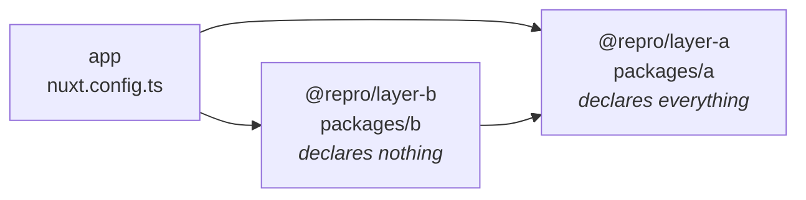
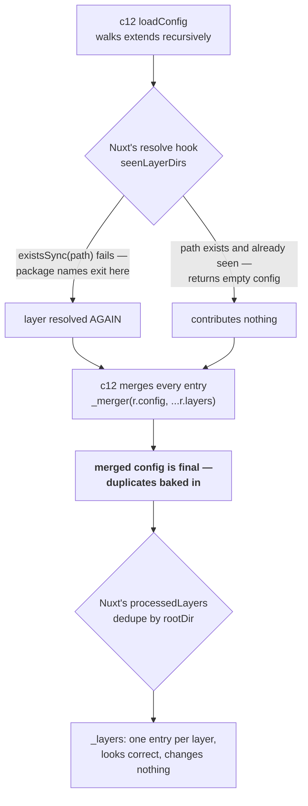

# Repro: a layer reached twice by package name has its config merged twice

One layer, authored once, reached by two paths in the `extends` graph. Every array it declares
comes out doubled — while `nuxt.options._layers` shows the layer exactly once, so nothing looks
wrong until something downstream breaks.

Two things break.

**The Cloudflare deploy fails, loudly.** `.output/server/wrangler.json` gets the cron schedule twice
and the Cloudflare API rejects it:

```
✘ [ERROR] Trigger configuration for "<worker>" was only partially updated:
    Cron schedules:
      - A request to the Cloudflare API (/accounts/<id>/workers/scripts/<worker>/schedules) failed.
        - duplicate cron found: 0 0 * * * [code: 10100]
```

**The scheduled task runs twice, silently.** `nitro.scheduledTasks` is an object, so its keys
collapse on merge — but the task list under each key is an array, and it doesn't:
`tasks: ["someTask", "someTask"]`. The task body executes twice on every fire, on any preset, with
no error anywhere. This half has nothing to do with cron trigger generation and no nitro release
fixes it.

The same graph spelled with **relative paths instead of package names** is clean in both respects.
That contrast is the finding: Nuxt already dedupes a layer reached twice, but the guard is gated on
an `existsSync` check that a package-name `extends` never passes.

| | |
| --- | --- |
| `nuxt` | 4.5.2 |
| `nitropack` | 2.13.4 (the current `latest`) |
| `c12` | 3.3.4 |
| `defu` | 6.1.7 |
| `node` | v24.20.0 |

Those are resolved versions, printed by the run rather than copied from `package.json`. They are at
the top of the result block in [`repro.log`](./repro.log).

## Run it

```bash
npm install
npm run repro
```

[`repro.mjs`](./repro.mjs) builds twice, once each way, and prints the merged config, the layer list
Nuxt kept, and what nitro generated. No Cloudflare account and no deploy: this is entirely a
build-time bug. It exits non-zero if the expected outcome is not observed, so it doubles as a
regression check.

## The graph



[`packages/a/nuxt.config.ts`](./packages/a/nuxt.config.ts) is the tip of the diamond and the only
file in the repo that declares any of these values:

```ts
nitro: {
  experimental: { tasks: true },
  scheduledTasks: { '0 0 * * *': ['someTask'] },
  cloudflare: { wrangler: { triggers: { crons: ['0 0 * * *'] } } },
  externals: { inline: ['some-package'] },
},
imports: { dirs: [/* packages/a/utils */] },
```

`REPRO_EXTENDS=path` swaps every `extends` entry from the package name to the equivalent relative
directory, in both places. Nothing else changes — same two layers, same diamond, same nitro.

## Result

Real output from `npm run repro`. Full log in [`repro.log`](./repro.log).

```
=============== RESULT ===============
node       : v24.20.0
nuxt       : 4.5.2
nitropack  : 2.13.4
c12        : 3.3.4
defu       : 6.1.7
--------------------------------------
authored once, in packages/a/nuxt.config.ts:
  nitro.cloudflare.wrangler.triggers.crons = ["0 0 * * *"]
  nitro.scheduledTasks                     = {"0 0 * * *":["someTask"]}
  nitro.externals.inline                   = ["some-package"]
  imports.dirs                             = [".../packages/a/utils"]
======================================
extends: ['@repro/layer-a', '@repro/layer-b']     <- package names
--------------------------------------
  nuxt.options._layers (cwd)               : repro, a, b
  ^ deduped: the repeat is NOT visible here
  merged nitro...triggers.crons            : ["0 0 * * *","0 0 * * *"]
  merged nitro.scheduledTasks              : {"0 0 * * *":["someTask","someTask"]}
  merged nitro.externals.inline            : ["some-package","some-package"]
  merged imports.dirs (count / unique)     : 2 / 1
  .output/server/wrangler.json "triggers"  : {"crons":["0 0 * * *","0 0 * * *"]}
  .output/server/.../nitro.mjs             : cron:"0 0 * * *",tasks:["someTask","someTask"]
======================================
extends: ['./packages/a', './packages/b']         <- same graph, relative paths
--------------------------------------
  nuxt.options._layers (cwd)               : repro, a, b
  merged nitro...triggers.crons            : ["0 0 * * *"]
  merged nitro.scheduledTasks              : {"0 0 * * *":["someTask"]}
  merged nitro.externals.inline            : ["some-package"]
  merged imports.dirs (count / unique)     : 1 / 1
  .output/server/wrangler.json "triggers"  : {"crons":["0 0 * * *"]}
  .output/server/.../nitro.mjs             : cron:"0 0 * * *",tasks:["someTask"]
======================================
package-name extends duplicates the cron   (expected true) : true
... and the scheduledTasks task list       (expected true) : true
... while _layers still looks deduped      (expected true) : true
relative-path extends does none of it      (expected true) : true
BUG REPRODUCED                                             : true
======================================
```

## Why `_layers` looks fine

This is the part that costs the debugging time. **There are two dedupes, and they are not the same
one.** One runs before the merge and prevents it; the other runs after, and only tidies the list.



**c12 does not dedupe at all.** `extendConfig` in `node_modules/c12/dist/index.mjs` pushes every
traversal onto `config._layers` with no identity check, and `loadConfig` then merges all of them:

```js
await extendConfig(r.config, options);
r.layers = r.config._layers;
delete r.config._layers;
r.config = _merger(r.config, ...r.layers.map((e) => e.config));   // duplicates merged here
```

That is deliberate — c12 offers a `resolve` hook so the consumer can implement whatever identity it
wants. Nuxt uses it, in `packages/kit/src/loader/config.ts` (built:
`node_modules/@nuxt/kit/dist/index.mjs:1102`), and this guard *is* what keeps the relative-path run
clean:

```js
const path = aliased ?? resolve(base, source);
if (!existsSync(path)) return;                      // <- package-name extends exits here
const layerDir = canonicalLayerDir(path);
if (seenLayerDirs.has(layerDir)) return { config: {}, cwd: layerDir, source };
seenLayerDirs.add(layerDir);
```

`@repro/layer-a` resolves to `<base>/@repro/layer-a`, which is not a real path, so the hook returns
early and c12 resolves and merges the layer a second time. Relative paths and `~`/`@` aliases pass
the check and are deduped.

The second dedupe, ~60 lines later in the same file, runs on what c12 handed back:

```js
if (processedLayers.has(resolvedRootDir)) continue;
processedLayers.add(resolvedRootDir);
```

This one *does* catch the package-name repeat — it works off `rootDir`, not a guessed path. But
`nuxtConfig` was cloned from `resolved.config`, which c12 already merged. So `_layers` comes out with
one entry per layer while the config keeps both copies of every array. **The duplication is invisible
in `nuxt.options._layers` and visible only in the merged values.**

The `seenLayerDirs` dedupe was added in Nuxt 4.5.1 by
[nuxt/nuxt#35712](https://github.com/nuxt/nuxt/pull/35712), for
[nuxt/nuxt#34667](https://github.com/nuxt/nuxt/issues/34667) — "Scheduled tasks executed twice if
scheduled in a layer", the same symptom reached through the auto-scan/`extends` overlap rather than
through a package name.

So the gap is narrow and specific: **`seenLayerDirs` needs the identity `processedLayers` already
computes correctly** — one that survives a layer named by package rather than by path.

## Blast radius

Duplication happens to every array in the merged config, but most of it is absorbed downstream.
Nuxt dedupes its own keys after the fact — `imports.dirs` above arrives with two entries and one
unique value, and `modules` and `css` are handled the same way.

**Nothing dedupes `nitro.*`.** `nitro.externals.inline` in the result block doubles and stays
doubled, exactly like the crons. So the practical rule is: *any array authored under `nitro.*` in a
layer that a diamond can reach twice is unprotected.*

## What about the manual `crons` array?

It only exists because `nitropack` 2.x does not derive Cloudflare cron triggers from
`scheduledTasks`. `writeWranglerConfig` in
`node_modules/nitropack/dist/presets/cloudflare/utils.mjs` has no cron handling at all, in `2.13.4`,
which is the current `latest` on the `nitropack` line. There is no version to upgrade to.

**`nitro@3` does derive them**, added by [nitrojs/nitro#4046](https://github.com/nitrojs/nitro/pull/4046)
(merged, closing [#3214](https://github.com/nitrojs/nitro/issues/3214)) and not backported. Verified
against `nitro@3.0.260903-beta` with a bare nitro app carrying `scheduledTasks` and **no**
`cloudflare.wrangler.triggers` at all:

```jsonc
// .output/server/wrangler.json
"triggers": { "crons": ["0 0 * * *"] }
```

That would let the manual array be deleted, taking the loud half of this bug with it —
`scheduledTasks` is an object, so its keys collapse on merge however many times the layer is
visited. `nitro@3` is also beta, and no released Nuxt uses it — Nuxt 4.5.2 depends on `nitropack` 2.x.

**It does not fix the quiet half**, and that was checked rather than assumed. Feeding
`scheduledTasks: { '0 0 * * *': ['someTask', 'someTask'] }` to a bare `nitro@3.0.260903-beta` app —
the shape a layer diamond produces — emits the duplicate straight through to the virtual module:

```js
// .output/server/index.mjs
const scheduledTasks = [{ "cron": "0 0 * * *", "tasks": ["someTask", "someTask"] }];
```

Nothing on that path dedupes. The builder (`nitro/dist/_build/common.mjs`, and character-for-character
the same in nitropack 2.13.4's `dist/core/index.mjs` `addNitroTasksVirtualFile`) filters the array
for *existence* only:

```js
tasks: (Array.isArray(_tasks) ? _tasks : [_tasks]).filter((name) => {
  if (!nitro.options.tasks[name]) {
    nitro.logger.warn(`Scheduled task \`${name}\` is not defined!`);
    return false;
  }
  return true;
})
```

Nor does the runtime collapse them. `runTask` keeps an in-flight cache, but it `await`s the task
resolver *before* writing to it:

```js
const handler = await tasks[name].resolve();      // <- yields here
const taskEvent = { name, payload, context };
__runningTasks__[name] = handler.run(taskEvent);  // <- cache written only now
```

`runCronTasks` calls `.map()` over the array, so both entries reach the `await` and yield before
either records itself; the second call still sees `undefined`. The guard only collapses a genuinely
later caller, never a sibling from the same array. Running the verbatim `runTask`/`runCronTasks`
against the emitted literal confirms it: **one cron fire, two concurrent executions of the task
body.** Identical in nitropack 2.13.4 and nitro 3.

Note the wrangler `triggers` are unaffected by this half — the cron list is built from
`Object.keys(scheduledTasks)`, so cron strings are unique by construction. Cloudflare fires once;
nitro runs the task twice inside that one fire. The two halves are genuinely independent failures of
the same merge.

Related and still open: [nitrojs/nitro#4155](https://github.com/nitrojs/nitro/issues/4155), tasks
scheduled in a layer running twice, reported against Nitro 2.13.1 / Nuxt 4.4.2 — the same quiet half.
Whether nitro should defensively dedupe the array is arguable (`scanHandlers` already dedupes with a
`seenHandlers` set, so it would not be out of house style), but the array should not have arrived
doubled in the first place.

## Prior art

| Issue | State | |
| --- | --- | --- |
| [nuxt/nuxt#34667](https://github.com/nuxt/nuxt/issues/34667) | closed, completed | Scheduled tasks run twice from a layer — fixed for local paths only |
| [nuxt/nuxt#35712](https://github.com/nuxt/nuxt/pull/35712) | merged, 4.5.1 | The `seenLayerDirs` dedupe, gated on `existsSync` |
| [nuxt/nuxt#28033](https://github.com/nuxt/nuxt/issues/28033) | **open** | Arrays in a layer's `runtimeConfig` duplicated |
| [nuxt/nuxt#21287](https://github.com/nuxt/nuxt/issues/21287) | closed, completed | Array duplication in `app.config.ts` from layers; a comment describes this exact diamond |
| [nitrojs/nitro#4155](https://github.com/nitrojs/nitro/issues/4155) | **open** | Layer-scheduled tasks run twice, Nitro 2.13.1 |
| [nitrojs/nitro#3214](https://github.com/nitrojs/nitro/issues/3214) | closed | Asked for `scheduledTasks` → cron triggers; delivered in v3 only |
| [unjs/c12#309](https://github.com/unjs/c12/issues/309) | closed, not planned | "Array content in a layer is duplicated" — by design |
| [unjs/defu#136](https://github.com/unjs/defu/issues/136) | closed, not planned | Array dedupe is unsafe as a default; use a custom merger |

None of them covers the package-name case.

## Workaround

Until `seenLayerDirs` covers package-named layers, either spell the `extends` entry as a relative
path or an alias, or author the array in the consuming app's own `nuxt.config.ts` — somewhere the
diamond cannot reach twice.
